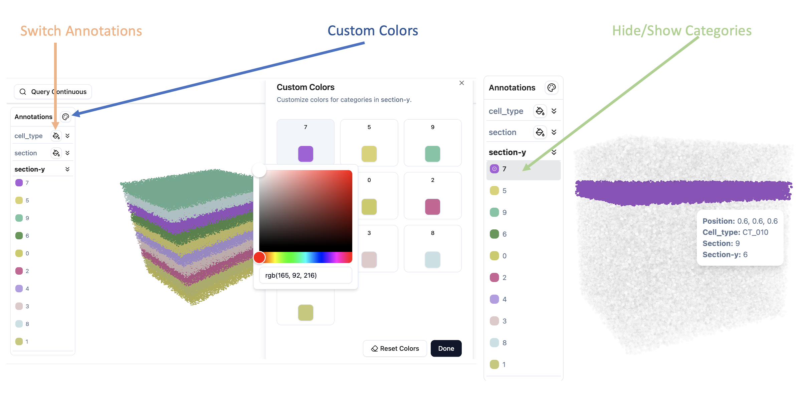
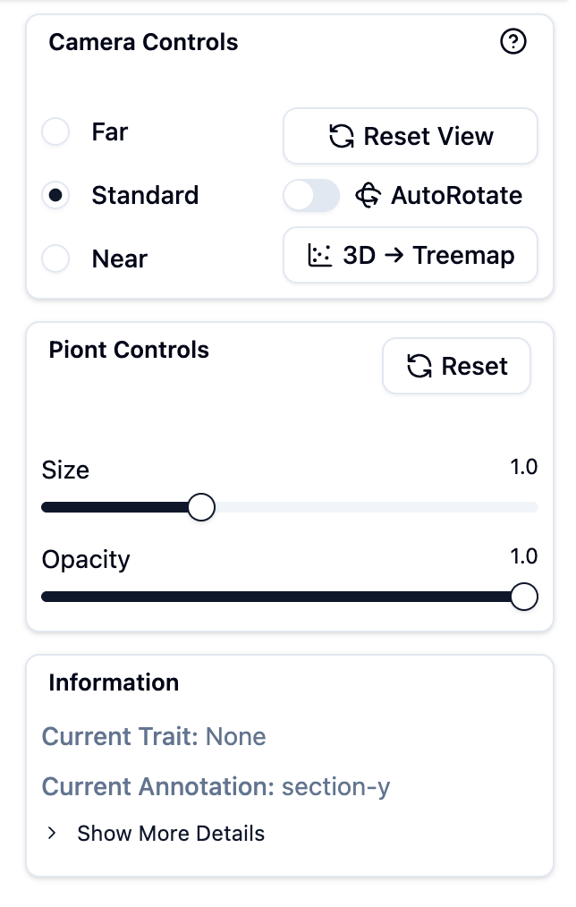
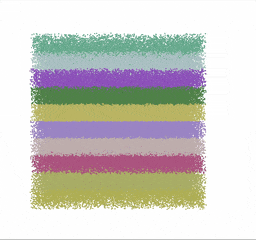
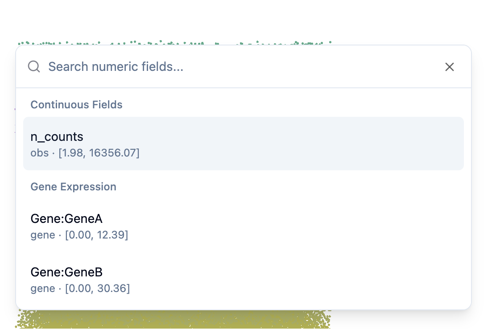
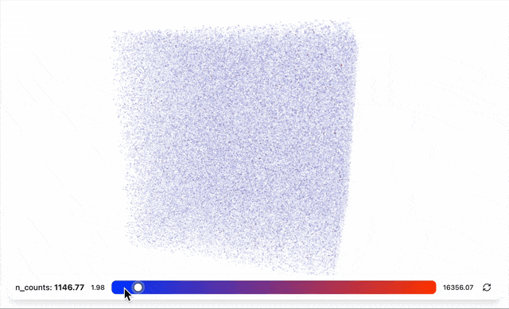
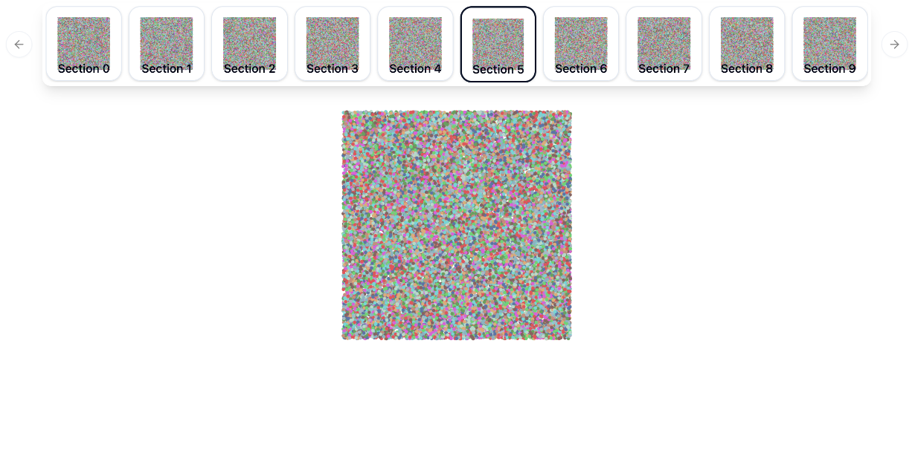

# Interactive Controls

Learn how to interact with SpatialVista visualizations in Jupyter.

## Navigation

### 3D/2D View Controls

- **Rotate**: Drag or <kbd>Shift</kbd> + <kbd>↑↓←→</kbd>
- **Pan**: <kbd>Shift</kbd> + Drag or <kbd>↑↓←→</kbd>
- **Zoom**: Mouse wheel scroll


## Annotation Panel

The left sidebar allows you to switch between different categorical annotations.


### Features

- **Switch Annotations**: Click on different annotation types to change the coloring
- **Hide/Show Categories**: Click on category names in the legend to toggle visibility
- **Custom Colors**: Click on color swatches to open the color picker and change category colors



## Control Panel

The right panel provides controls for adjusting visualization parameters.



### Point Size

Adjust the size of individual points in the visualization.

- Use the slider to increase or decrease point size
- Useful for sparse or dense datasets

### Point Opacity

Control the transparency of points.

- Lower values: More transparent (better for seeing overlapping structures)
- Higher values: More opaque (better for sparse data)

### Slice Spacing

For 3D datasets loaded with a `section` key, use **Slice spacing** in Point Controls to adjust stacked slices along the Z axis:

- **Multiplier** scales the original distance between section centers. `1.0×` keeps the original spacing, `0×` aligns the centers, and values up to `10.0×` expand the stack.
- **Fixed distance** assigns a uniform numeric Z distance between adjacent section centers, such as `100`, regardless of their original spacing.

The controls are available only in the 3D point-cloud view. Both modes preserve Z variation within each slice.

### Section Alignment

For datasets with section information, the **Section Alignment** panel supports per-slice XY translation, rotation, uniform scaling, and X/Y flipping:

1. Choose a fixed **Reference section**.
2. Choose the **Active section** to transform.
3. Choose **Hybrid**, **Outline only**, or **Annotation only**.
4. For modes that use annotations, select a field such as `organ` or `celltype`. Hybrid mode also lets you balance outline and annotation evidence.
5. Click **Auto align**, then fine-tune the numeric controls while viewing the result.

Numeric inputs apply only when Enter is pressed. The compact XY pad, rotation dial, and sliders update the point cloud immediately during mouse or touch movement. Flip buttons also apply immediately. Hover over the question-mark button in the panel header for a compact interaction guide.

**Annotation only** matches the centers of shared categories. **Outline only** rasterizes each slice to a small occupancy grid, extracts at most 320 boundary representatives, and minimizes a symmetric Chamfer distance between the two boundaries. **Hybrid** combines normalized outline and annotation errors using the selected weight. All modes evaluate unflipped, X-flipped, Y-flipped, and XY-flipped candidates. Outline-based modes perform a coarse rotation search followed by two local refinement passes.

Automatic scaling is disabled by default because sparse landmarks or genuinely different adjacent tissue outlines can produce misleading scale estimates. When explicitly enabled, the estimated scale is clamped to `0.5–2×`. Use **Export alignment JSON** to save the auto-alignment settings, transforms, flips, and Z-spacing settings.

Two batch workflows are available. **First → all** keeps the first section as the reference and aligns every later section to it. **S1 → S2 → …** aligns the second section to the first, then uses the aligned second section as the reference for the third, continuing through the stack. Starting either workflow replaces the current per-section transforms with the new workflow result.

In Jupyter, the same parameters are synchronized to the widget:

```python
widget.alignment_parameters
widget.apply_alignment(output_key="spatial_aligned")
```

The second command writes aligned three-dimensional coordinates to `adata.obsm["spatial_aligned"]`.

### Layout Modes

Switch between different spatial arrangements:

- **Original**: Display points at their original coordinates
- **2D Treemap**: Arrange points in a space-filling treemap layout
- **2D Histogram**: Arrange points in histogram bins



## Continuous Values & Gene Expression

### Selecting Variables

Use the dropdown menu to select continuous values or gene expression:


- **Continuous observations**: QC metrics, cell scores, etc.
- **Gene expression**: Any gene from your dataset


### Threshold Slider

When a continuous value or gene is selected, a slider appears at the bottom:


- **Adjust threshold**: Move the slider to filter points by value
- **Color gradient**: The background shows the value range
- **Reset**: Click the reset button to return to minimum value


## View Switching

### 2D/3D Toggle

If your data has section information, you can switch between views:

- **3D View**: Full 3D point cloud
- **2D View**: Section-by-section 2D slices

### Section Carousel

In 2D mode, use the section carousel to browse different slices:


- **Click thumbnails**: Jump to a specific section
- **Preview**: Each thumbnail shows a preview of that section


## Screenshots

### Capture Current View

Click the camera icon in the header to save the current visualization:


- Captures exactly what you see on screen
- Downloads as PNG image
- Includes current colors, filters, and layout


---

**Next**: Check the [API Reference](api/index.md) for programmatic control options.
