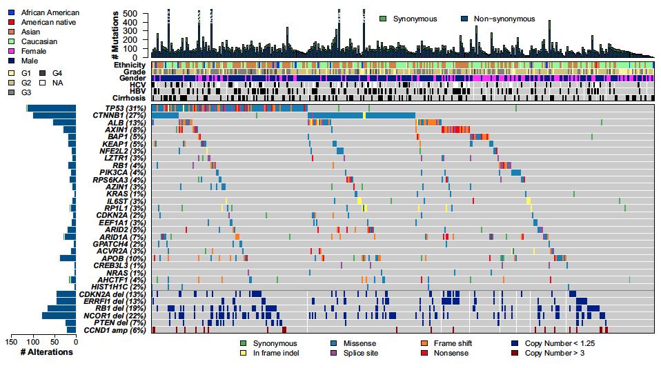

```{r setup, include=FALSE}
knitr::opts_chunk$set(echo = TRUE)
```

## 需求描述
用R代码画出paper里的oncoprint图，又叫瀑布图。



出自<https://www.cell.com/cell/abstract/S0092-8674(17)30639-6>

## 使用场景

展示多个样本中多个基因的突变情况，包括但不限于SNP、indel、CNV。

尤其是几十上百的大样本量的情况下，一目了然，看出哪个基因在哪个人群里突变多，以及多种突变类型的分布。

场景一：作为全基因组测序或全外显子组测序文章的第一个图。

场景二：展示感兴趣的癌症类型里，某一个通路的基因突变情况。


## 下载TCGA数据

需要下载突变信息和临床信息，作为输入数据。

```{r,message=FALSE,warning=FALSE}
#source("https://bioconductor.org/biocLite.R")
#biocLite("TCGAbiolinks")
library(TCGAbiolinks)

#查看癌症项目名缩写
cancerName<-data.frame(id = TCGAbiolinks:::getGDCprojects()$project_id, name = TCGAbiolinks:::getGDCprojects()$name)
cancerName
```

### 下载临床信息

参数`project = `后面写你要看的癌症名称缩写

```{r,message=FALSE}
clinical <- GDCquery(project = "TCGA-LIHC", 
                  data.category = "Clinical")

GDCdownload(clinical)

cliquery <- GDCprepare_clinic(clinical, clinical.info = "patient")
colnames(cliquery)[1] <- "Tumor_Sample_Barcode"
str(cliquery)
```

理论上，`$`符号后面的单词都可以作为分类信息画出来。

history_hepato_carcinoma_risk_factors里有50种，需要提取其中的Hepatitis B、Hepatitis C和cirrhosis。

```{r}
cliquery$HBV <- 0
cliquery$HBV[grep(pattern = "Hepatitis B",cliquery$history_hepato_carcinoma_risk_factors)] <- 1

cliquery$HCV <- 0
cliquery$HCV[grep(pattern = "Hepatitis C",cliquery$history_hepato_carcinoma_risk_factors)] <- 1

cliquery$cirrhosis <- 0
cliquery$cirrhosis[grep(pattern = "cirrhosis",cliquery$history_hepato_carcinoma_risk_factors)] <- 1

```

后面我们将以`neoplasm_histologic_grade`，`gender`，`race_list`，`HCV`，`HBV`，`cirrhosis`作为分类画图。


###下载突变数据

4种找mutation的pipeline任选其一：`muse`, `varscan2`, `somaticsniper`, `mutect2`，此处选mutect2。

```{r,message=FALSE}
mut <- GDCquery_Maf(tumor = "LIHC", pipelines = "mutect2")
```

## 开始画图

```{r,message=FALSE}
#source("https://bioconductor.org/biocLite.R")
#biocLite("maftools")
library(maftools)
maf <- read.maf(maf = mut, clinicalData = cliquery, isTCGA = T)
```

### 用默认配色方案展示突变频率排名前20的基因

```{r}
pdf("oncoplotTop20.pdf",width = 12,height = 6)
oncoplot(maf = maf,
         top = 20,
         fontSize = 8,legendFontSize = 8,annotationFontSize = 8,
         clinicalFeatures = c("race_list","neoplasm_histologic_grade","gender","HCV","HBV","cirrhosis")
         )
dev.off()
```


### 用默认配色方案展示一个列表里的基因

把你感兴趣的基因名存到`easy_input.txt`文件里，每个基因为一行。就可以只画这几个基因，其中没发生突变的基因会被忽略。

```{r}
geneName<-read.table("easy_input.txt",header = F,as.is = T)
genelist<-geneName$V1

pdf("oncoplotLIST.pdf",width = 12,height = 6)
oncoplot(maf = maf,
         genes = genelist,
         fontSize = 8,legendFontSize = 8,annotationFontSize = 8,
         clinicalFeatures = c("race_list","neoplasm_histologic_grade","gender","HCV","HBV","cirrhosis") 
         )
dev.off()
```


### 重新配色展示突变频率排名前20的基因

默认的颜色不够好看，还可以改配色

```{r}
#突变
col = RColorBrewer::brewer.pal(n = 10, name = 'Paired')
names(col) = c('Frame_Shift_Del','Missense_Mutation', 'Nonsense_Mutation', 'Frame_Shift_Ins','In_Frame_Ins', 'Splice_Site', 'In_Frame_Del','Nonstop_Mutation','Translation_Start_Site','Multi_Hit')

#人种
racecolors = RColorBrewer::brewer.pal(n = 4,name = 'Spectral')
names(racecolors) = c("ASIAN", "WHITE", "BLACK_OR_AFRICAN_AMERICAN",  "AMERICAN_INDIAN_OR_ALASKA_NATIVE")

#病毒、肝硬化
factcolors = c("grey","black")
names(factcolors) = c("0","1")
annocolors = list(race_list = racecolors, HCV = factcolors, HBV = factcolors, cirrhosis = factcolors)

#画图
pdf("oncoplotTop20_col.pdf",width = 12,height = 6)
oncoplot(maf = maf,
         colors = col,#给突变配色
         annotationColor = annocolors,#给临床信息配色
         top = 20,
         fontSize = 8,legendFontSize = 8,annotationFontSize = 8,
         clinicalFeatures = c("race_list","neoplasm_histologic_grade","gender","HCV","HBV","cirrhosis"),
         writeMatrix =T)
dev.off()
```


```{r}
sessionInfo()
```
