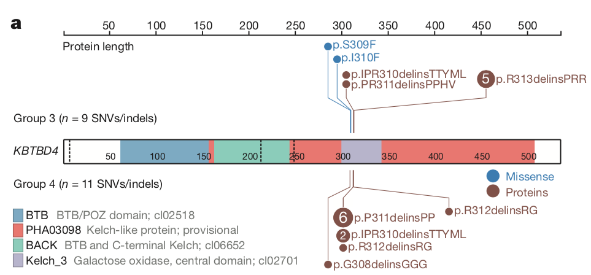

```{r setup, include=FALSE}
knitr::opts_chunk$set(echo = TRUE)
```

微信ID: epigenomics  E-mail: epigenomics@rainbow-genome.com

### 需求描述
用R代码画出paper里的Lollipop，棒棒糖🍭。



出自<https://www.nature.com/articles/nature22973>

###  应用场景

某个基因的突变发生在哪个重要的结构域？推测该位点的突变影响了蛋白质功能。

场景一：展示TCGA某个癌症类型里某个基因的突变位点。

场景二：对比不同癌症/亚型的突变位点。

### 下载TCGA数据

如果你要画的基因突变信息已经保存在类似`easy_input.csv`的文件里，就可以跳过这步，直接进入“输入数据”。

下载突变信息作为输入数据。

```{r,message=FALSE,warning=FALSE}
#source("https://bioconductor.org/biocLite.R")
#biocLite("TCGAbiolinks")
library(TCGAbiolinks)
mutquery <- GDCquery(project = "TCGA-LIHC",
                    data.category = "Simple Nucleotide Variation",
                    data.type = "Masked Somatic Mutation",
                    workflow.type = "Aliquot Ensemble Somatic Variant Merging and Masking")#可能需要使用VPN才能下载数据，下面代码也是
GDCdownload(mutquery)
mut<-GDCprepare(mutquery)

#运行下面这行，会把所有基因的突变数据保存到文件里，你可以用这个文件做更多的事情。
#write.csv(mut,"TCGA_SNV.csv")

#画棒棒糖图只需要其中的一个基因，我们单独抽提出来，此处提取TP53。
write.table(mut[mut$Hugo_Symbol == "TP53",],"easy_input.txt",row.names = F,quote = F,sep = "\t")
```

### 输入数据

需要结构域和突变信息。

#### 突变信息

此处直接用TCGA的突变数据，有很多列，其中`RefSeq``HGVSp` `HGVSp_Short`三列是必须的。

因此，你也可以只准备这三列。

```{r}
df<-read.table("easy_input.txt",as.is = T,sep = "\t",header = T)

#筛掉氨基酸未突变的行
newdf<-df[!is.na(df$HGVSp),]
```

#### 结构域

根据基因名（此处是TP53）和refseq ID从maftools提供的蛋白domain注释中提取某个基因的domain注释

```{r,message=FALSE}
library(maftools)
gff = readRDS(file = system.file('extdata', 'protein_domains.RDs', package = 'maftools'))
refseqid <- strsplit(x = as.character(newdf$RefSeq), split = '.', fixed = TRUE)[[1]][1]
protein_inform <- gff[HGNC %in% "TP53"][refseq.ID == refseqid,]
```

#### 从突变注释中提取氨基酸位置

先写个函数，用于从突变注释中提取氨基酸位置
```{r}
extractpos <- function(maf_aachange){
  prot.spl = strsplit(x = as.character(maf_aachange), split = '.', fixed = TRUE)
  prot.conv = sapply(sapply(prot.spl, function(x) x[length(x)]), '[', 1)
  pos = gsub(pattern = 'Ter.*', replacement = '',x = prot.conv)
  pos = gsub(pattern = '[[:alpha:]]', replacement = '', x = pos)
  pos = gsub(pattern = '\\*$', replacement = '', x = pos)
  pos = gsub(pattern = '^\\*', replacement = '', x = pos)
  pos = gsub(pattern = '\\*.*', replacement = '', x = pos)
  pos = as.numeric(sapply(X = strsplit(x = pos, split = '_', fixed = TRUE), FUN = function(x) x[1])) 
  aa = paste0(unlist(regmatches(maf_aachange, gregexpr("p[.].[0-9]+",maf_aachange))),"X")
  mutpos = data.frame(position = pos, mutation = maf_aachange, aa = aa, stringsAsFactors = F)
  return(mutpos[order(mutpos$pos),])
}
```

从突变注释中提取氨基酸位置
```{r}
pos <- extractpos(newdf$HGVSp_Short)
head(pos)
```

统计不同氨基酸突变类型的突变频率
```{r}
nrpos <- pos[!duplicated(pos),]
rownames(nrpos) <- nrpos$mutation
nrpos$rate <- 1
nrpos[names(table(pos$mutation)),]$rate <-table(pos$mutation)
head(nrpos)
```

### 开始画图
```{r,message=FALSE}
#source("https://bioconductor.org/biocLite.R")
#biocLite("trackViewer")
library(trackViewer)
library(RColorBrewer)

#首先将上面获得的蛋白domain注释信息写入一个GRanges对象
features <- GRanges("chr1", IRanges(start=protein_inform$Start,end=protein_inform$End,names=protein_inform$Description))
features$height <- 0.07 #domain box高
features$fill<-brewer.pal(9,"Set1")[1:3] #domain box颜色

#将突变点的信息写入一个GRanges对象
sample.gr <- GRanges("chr1", IRanges(nrpos$position, width=1, names=nrpos$mutation))
sample.gr$label.parameter.rot <- 90 #label角度
sample.gr$label <- as.character(nrpos$rate) #点中的标记
sample.gr$label.col <- "white" #点中标记的颜色
sample.gr$color <-sample.gr$border <- brewer.pal(9,"Set1")[4] #点及连线颜色
sample.gr$score<- log2(nrpos$rate) #点所在高度（纵坐标）

pdf("test1.pdf",width=24,height = 5)
lolliplot(sample.gr, features,xaxis = c(protein_inform$Start,protein_inform$End),yaxis = F, ylab = F,type="circle")
dev.off()
```


突变点太拥挤，解决办法是分上下两层，点可随机分。

注意这里也可按照临床信息分类（只能分2类），这样更有意义，下面把点随机分上下两层：

```{r}
torb <- sample(c("top", "bottom"), length(sample.gr), replace=TRUE)
sample.gr$SNPsideID <- torb
sample.gr$color[torb=="bottom"] <- sample.gr$border[torb=="bottom"] <- brewer.pal(9,"Set1")[7]

pdf("test2.pdf",width=21)
lolliplot(sample.gr, features,xaxis = c(protein_inform$Start,protein_inform$End),yaxis = F, ylab = F,type="circle")
dev.off()
```


点内的标记太多，去掉1
```{r}
labs<-sample.gr$label
labs[labs=="1"]<-""
sample.gr$label <- labs
pdf("test3.pdf",width=21)
lolliplot(sample.gr, features,xaxis = c(protein_inform$Start,protein_inform$End),yaxis = F, ylab = F,type="circle")
dev.off()
```


根据突变频率设置点大小
```{r}
sample.gr$cex <- log10(nrpos$rate) + 0.4
pdf("test4.pdf",width=21)
lolliplot(sample.gr, features,xaxis = c(protein_inform$Start,protein_inform$End),yaxis = F, ylab = F,type="circle")
dev.off()
```


进一步根据突变位置整合突变,如将p.Y126D 和 p.Y126D 合并成p.Y126X
```{r}
newpos <- pos[!duplicated(pos$position),]
newpos$aachange <- newpos$mutation
rownames(newpos) <-newpos$position
duppos <- names(table(pos$position)[table(pos$position)>1])
newpos[duppos,]$aachange <- newpos[duppos,]$aa

sample.gr <- GRanges("chr1", IRanges(newpos$position, width=1, names=newpos$aachange))
sample.gr$label.parameter.rot <- 45
sample.gr$label <- as.character(table(pos$position))
sample.gr$label.col <- "white"
sample.gr$color <-sample.gr$border <- brewer.pal(9,"Set1")[4]
sample.gr$score<- log2(table(pos$position))
labs<-sample.gr$label
labs[labs=="1"]<-""
sample.gr$label <- labs
torb <- sample(c("top", "bottom"), length(sample.gr), replace=TRUE)
sample.gr$SNPsideID <- torb
sample.gr$color[torb=="bottom"] <- sample.gr$border[torb=="bottom"] <- brewer.pal(9,"Set1")[7]

pdf("test5.pdf",width=21)
lolliplot(sample.gr, features,xaxis = c(protein_inform$Start,protein_inform$End),yaxis = F, ylab = F,type="circle")
dev.off()
```


```{r}
sessionInfo()
```