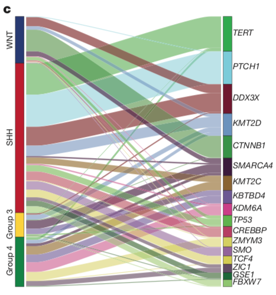
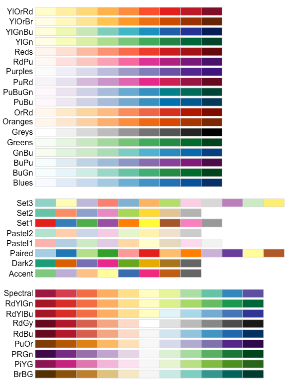

### 需求描述
用R代码画出paper里的图。



出自<https://www.nature.com/articles/nature22973>

### 应用场景

一套数据集可能有多重属性，每层属性之间有交叉，就可以用这种图来展示。

- 场景一：一个group包含多个基因，同一个基因的不同突变可能属于多个group。像例图一样，展示高频突变基因所处的分组。

原文：Graphical summary of the most frequently mutated genes (≥10 affected cases) and their subgroup distribution.

... many of which showed clear subgroup-specificity (Fig. 2a–c; Extended Data Fig. 3a, b; Supplementary Table 2). 

- 场景二：miRNA和靶基因的关系；

- 场景三：人群按性别、年龄、家族史等特征分组，展示不同分组得癌症的规律。

### 输入数据

至少要有两列。

```{r}
df <- read.table("easy_input.txt",sep = "\t",row.names = 1,header = T)
head(df)
```

第一列是基因，第二列是突变，第三列是癌症亚型；

或者只写两列，第一列是miRNA，第二列是它的靶基因。

### 开始画图

```{r,message=FALSE,warning=FALSE}
#install.packages("ggalluvial")
library(ggalluvial)

#定义足够多的颜色，后面从这里选颜色
mycol <- rep(c("#223D6C","#D20A13","#FFD121","#088247","#11AA4D","#58CDD9","#7A142C","#5D90BA","#029149","#431A3D","#91612D","#6E568C","#E0367A","#D8D155","#64495D","#7CC767"),2)

#格式转换
UCB_lodes <- to_lodes_form(df[,1:ncol(df)],
                           axes = 1:ncol(df),
                           id = "Cohort")
dim(UCB_lodes)

head(UCB_lodes)
tail(UCB_lodes)
```


```{r,fig.width=6,fig.height=6}
ggplot(UCB_lodes,
       aes(x = x, stratum = stratum, alluvium = Cohort,
           fill = stratum, label = stratum)) +
  scale_x_discrete(expand = c(0, 0)) + 
  geom_flow(width = 1/8) + #线跟方块间空隙的宽窄
  geom_stratum(alpha = .9,width = 1/10) + #方块的透明度、宽度
  geom_text(stat = "stratum", size = 3,color="black") + #文字大小、颜色
  
  #不喜欢默认的配色方案，用前面自己写的配色方案
  scale_fill_manual(values = mycol) +

  xlab("") + ylab("") +
  theme_bw() + #去除背景色
  theme(panel.grid =element_blank()) + #去除网格线
  theme(panel.border = element_blank()) + #去除外层边框
  theme(axis.line = element_blank(),axis.ticks = element_blank(),axis.text = element_blank()) + #去掉坐标轴
  ggtitle("")+
  guides(fill = FALSE) 

ggsave("sankey3.pdf")
```

还可以只选其中一部分列来画，此处只画第一列和第三列
                           
```{r,fig.width=6,fig.height=3}
UCB_lodes <- to_lodes_form(df[,c(1,3)],
                           axes = 1:2,
                           id = "Cohort")
dim(UCB_lodes)

ggplot(UCB_lodes,
       aes(x = x, stratum = stratum, alluvium = Cohort,
           fill = stratum, label = stratum)) +
  scale_x_discrete(expand = c(0, 0)) + 
  
  #用aes.flow参数控制线从哪边来，颜色就跟哪边一致。
  #默认是forward，此处用backward。
  geom_flow(width = 1/8,aes.flow = "backward") +
  
  coord_flip() + #旋转90度
  geom_stratum(alpha = .9,width = 1/10) +
  geom_text(stat = "stratum", size = 3,color="black") +

  #如果分组少，可以用scale_fill_brewer。修改type和palette两个参数选择配色方案，更多配色方案参考下图，分别对应type参数的“Seq”、“qual”、“Div”
  #scale_fill_brewer(type = "Div", palette = "BrBG") +
  
  #如果分组太多，就要用前面自己写的配色方案
  scale_fill_manual(values = mycol) +

  xlab("") + ylab("") +
  theme_bw() + 
  theme(panel.grid =element_blank()) + 
  theme(panel.border = element_blank()) + 
  theme(axis.line.x = element_blank(),axis.ticks = element_blank(),axis.text.x = element_blank()) + #显示分组名字
  ggtitle("") +
  guides(fill = FALSE) 

ggsave("sankey2.pdf")
```

此处用ggsave把图保存到pdf文件中。

如果你通过复制粘贴来运行，需要调整pdf文件的长宽比，在嘉因公众号回复“小白”查看方法。



```{r}
citation("ggalluvial")
sessionInfo()
```
