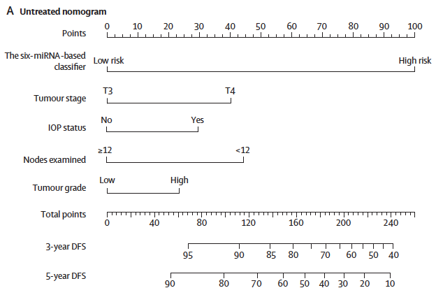
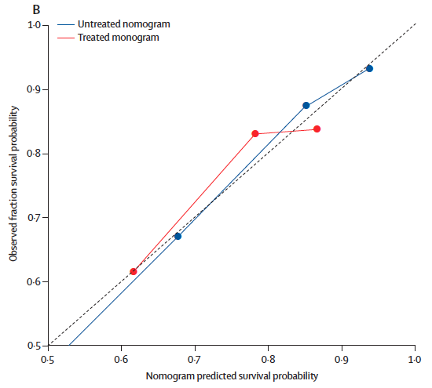
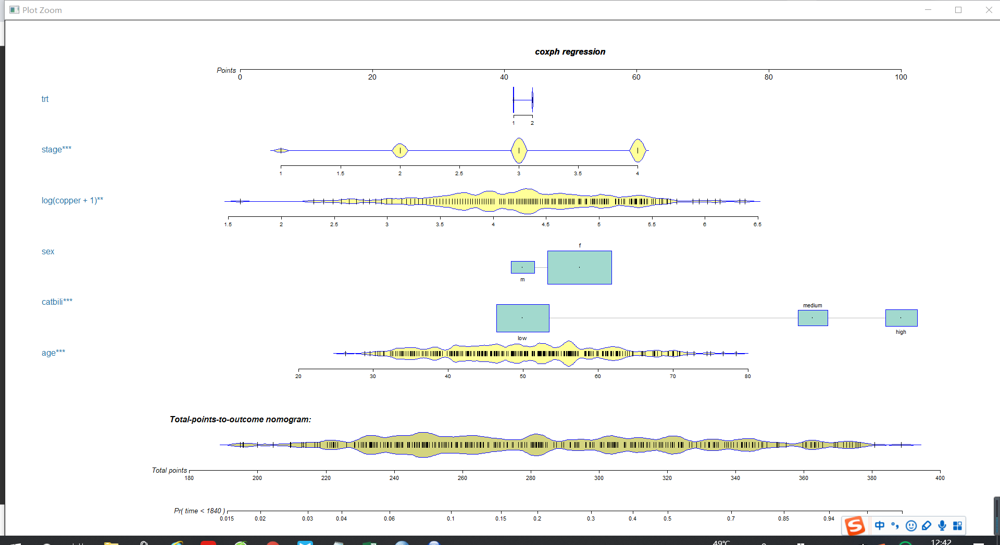

```{r setup, include=FALSE}
knitr::opts_chunk$set(echo = TRUE)
```

### 需求描述

画出paper里的nomogram图和对比曲线





出自<https://linkinghub.elsevier.com/retrieve/pii/S1470-2045(13)70491-1>

画出新型nomogram



### 应用场景

列线图（nomogram，诺莫图）是在平面直角坐标系中用一簇互不相交的线段表示多个独立变量之间函数关系的图。

将Logistic回归或Cox回归的结果进行可视化呈现，给出其发病风险或比例风险。

### 输入数据

至少要有临床信息`easy_input.csv`，还可以加入FigureYa31lasso输出的`lasso_output.txt`

```{r}
pbc<-read.table("easy_input.txt")

pbc$catbili <- cut(pbc$bili,breaks=c(-Inf, 2, 4, Inf),
                   labels=c("low","medium","high"))
pbc$died <- pbc$status==2

head(pbc)
```

### 开始画nomogram

这里提供两种风格的nomogram画法，用到不同的包

#### 经典版

```{r,message=FALSE,warning=FALSE,fig.width=10,fig.height=6}
#install.packages("rms")
library(rms)

dd<-datadist(pbc)
options(datadist="dd")
options(na.action="na.delete")
summary(pbc$time)
coxpbc<-cph(formula = Surv(time,died) ~  age + catbili + sex + copper + stage + trt ,data=pbc,x=T,y=T,surv = T,na.action=na.delete)  #,time.inc =2920

print(coxpbc)
surv<-Survival(coxpbc) 
surv3<-function(x) surv(1825,x)
surv4<-function(x) surv(2920,x)

x<-nomogram(coxpbc,fun = list(surv3,surv4),lp=T,
            funlabel = c('5-year survival Probability','8-year survival Probability'),
            maxscale = 100,fun.at = c(0.95,0.9,0.8,0.7,0.6,0.5,0.4,0.3,0.2,0.1))

pdf("nomogram_classical.pdf",width = 12,height = 10)
plot(x, lplabel="Linear Predictor",
     xfrac=.35,varname.label=TRUE, varname.label.sep="=", ia.space=.2, 
     tck=NA, tcl=-0.20, lmgp=0.3,
     points.label='Points', total.points.label='Total Points',
     total.sep.page=FALSE, 
     cap.labels=FALSE,cex.var = 1.6,cex.axis = 1.05,lwd=5,
     label.every = 1,col.grid = gray(c(0.8, 0.95)))
dev.off()
```


#### 输出公式

```{r}
#print(x)
#install.packages("nomogramEx")
library(nomogramEx)
nomogramEx(nomo=x,np=2,digit = 9)
```

#### 新型nomogram

`regplot`可以交互式调整nomogram，代码更简单，输出的图形更漂亮。

把`regplot`那段代码粘贴到Console里，回车，就会在Plots窗口出现图。

鼠标点击栏目上方蓝色按钮，可以选择变量展示的类型：箱图、小提琴图、密度曲线图等；需要什么图，导出PDF进行AI修改即可。

鼠标点击Esc或按键盘上的Esc可以退出交互模式

```{r}
#不喜欢默认的颜色，先设置几个颜色
mycol<-c("#A6CEE3","#1F78B4","#33adff","#2166AC")
names(mycol) = c("dencol","boxcocl","obscol","spkcol")
mycol<- as.list(mycol)

#install.packages("regplot","vioplot","sm","beanplot")
library(survival)
pbccox <- coxph(formula = Surv(time,died) ~  age + catbili + sex + 
                   copper + stage + trt , data = pbc)

library(regplot)

pdf("nomogram_new.pdf")
regplot(pbccox,
        #对观测2的六个指标在列线图上进行计分展示
        observation=pbc[2,], #也可以不展示
        
        #预测3年和5年的死亡风险，此处单位是day
        failtime = c(1095,1825), 
        prfail = TRUE, #cox回归中需要TRUE
        showP = T, #是否展示统计学差异
        droplines = F,#观测2示例计分是否画线
        colors = mycol, #用前面自己定义的颜色
        rank="decreasing", #根据统计学差异的显著性进行变量的排序
        interval="confidence") #展示观测的可信区间
dev.off()
```

展示逻辑回归，支持"lm", "glm", "coxph", "survreg" "negbin"

```{r}
## Plot a logistic regression, showing odds scale and confidence interval
pbcglm <- glm(died ~  age + catbili + sex + copper, family = "binomial", data=pbc )

regplot(pbcglm, 
        observation=pbc[1,], 
        odds=TRUE, 
        interval="confidence")
```


### 绘制calibration curve进行验证

采用和nomogram一样的变量进行多因素cox回归

#### 5年

```{r}
f5<-cph(formula = Surv(time,died) ~  age + catbili + sex + copper +stage + trt,data=pbc,x=T,y=T,surv = T,na.action=na.delete,time.inc = 1825) 

#参数m=50表示每组50个样本进行重复计算
cal5<-calibrate(f5, cmethod="KM", method="boot",u=1825,m=50,B=1000) 

pdf("calibration_5y.pdf",width = 8,height = 8)
plot(cal5,
     lwd = 2,#error bar的粗细
     lty = 1,#error bar的类型，可以是0-6
     errbar.col = c("#2166AC"),#error bar的颜色
     xlim = c(0,1),ylim= c(0,1),
     xlab = "Nomogram-prediced OS (%)",ylab = "Observed OS (%)",
     cex.lab=1.2, cex.axis=1, cex.main=1.2, cex.sub=0.6) #字的大小
lines(cal5[,c('mean.predicted',"KM")], 
      type = 'b', #连线的类型，可以是"p","b","o"
      lwd = 2, #连线的粗细
      pch = 16, #点的形状，可以是0-20
      col = c("#2166AC")) #连线的颜色
mtext("")
box(lwd = 1) #边框粗细
abline(0,1,lty = 3, #对角线为虚线
       lwd = 2, #对角线的粗细
       col = c("#224444")#对角线的颜色
       ) 
dev.off()
```


#### 8年

```{r, fig.width=8,highlight=8}
f8<-cph(formula = Surv(time,died) ~  age + catbili + sex + copper +stage + trt,data=pbc,x=T,y=T,surv = T,na.action=na.delete,time.inc = 2920) 
cal8<-calibrate(f8, cmethod="KM", method="boot",u=2920,m=50,B=1000)

plot(cal8,
     lwd = 2,
     lty = 1,
     errbar.col = c("#B2182B"),
     xlim = c(0,1),ylim= c(0,1),
     xlab = "Nomogram-prediced OS (%)",ylab = "Observed OS (%)",
     col = c("#B2182B"),
     cex.lab=1.2,cex.axis=1, cex.main=1.2, cex.sub=0.6)
lines(cal8[,c('mean.predicted',"KM")],
      type= 'b',
      lwd = 2,
      col = c("#B2182B"),
      pch = 16)
mtext("")
box(lwd = 1)
abline(0,1,lty= 3,
       lwd = 2,
       col =c("#224444"))
```

#### 同时展示两条curve

```{r}
pdf("calibration_compare.pdf",width = 8,height = 8)
plot(cal5,lwd = 2,lty = 0,errbar.col = c("#2166AC"),
     bty = "l", #只画左边和下边框
     xlim = c(0,1),ylim= c(0,1),
     xlab = "Nomogram-prediced OS (%)",ylab = "Observed OS (%)",
     col = c("#2166AC"),
     cex.lab=1.2,cex.axis=1, cex.main=1.2, cex.sub=0.6)
lines(cal5[,c('mean.predicted',"KM")],
      type = 'b', lwd = 1, col = c("#2166AC"), pch = 16)
mtext("")

plot(cal8,lwd = 2,lty = 0,errbar.col = c("#B2182B"),
     xlim = c(0,1),ylim= c(0,1),col = c("#B2182B"),add = T)
lines(cal8[,c('mean.predicted',"KM")],
      type = 'b', lwd = 1, col = c("#B2182B"), pch = 16)

abline(0,1, lwd = 2, lty = 3, col = c("#224444"))

legend("topleft", #图例的位置
       legend = c("5-year","8-year"), #图例文字
       col =c("#2166AC","#B2182B"), #图例线的颜色，与文字对应
       lwd = 2,#图例中线的粗细
       cex = 1.2,#图例字体大小
       bty = "n")#不显示图例边框
dev.off()
```


```{r}
sessionInfo()
```
