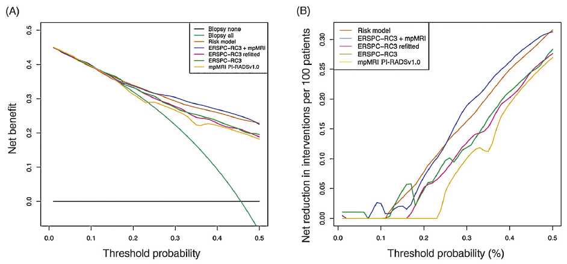

```{r setup, include=FALSE}
knitr::opts_chunk$set(echo = TRUE)
```

### 需求描述

画出paper里的DCA曲线



出自<https://www.europeanurology.com/article/S0302-2838(17)30267-1/fulltext>

### 应用场景

生存数据因为带了时间和事件发生的混合因素，适合用`stdca.R`这个function，是MSKCC的统计学专家写的。

队列研究里，像例文的B图那样，有opt-in 和opt-out两种选择，来帮助确定高风险的患者进行干预、低风险的患者避免过度医疗。这个图的最终目的就是为了展示这个价值。

### 输入文件

此处用到的输入数据跟`FigureYa30nomogram`里的easy_input.txt是同一个文件，来自`survival`包。

```{r,message=FALSE}
pbc<-read.table("easy_input.txt")

#先把bili分为三类：低、中、高
pbc$catbili <- cut(pbc$bili,breaks=c(-Inf, 2, 4, Inf),
                   labels=c("low","medium","high"))

#把status分为两类，原来的2为变成1，原来的1和0变成0
pbc$died <- pbc$status==2
pbc$status =ifelse(pbc$died=="TRUE",1,0)

head(pbc)
```

模仿`easy_input.txt`，修改你手里数据的格式。

#### 利用系数重新预测模型

```{r}
library(survival)
Srv = Surv(pbc$time, pbc$died)

#此处选择5年的时间节点，输入文件的time列的单位是天，5年是1825天。
#下面每两行计算1种cox模型的系数，后面将画图对比
coxmod1 = coxph(Srv ~ trt + age + sex + hepato + catbili + copper + stage, data=pbc)
pbc$model1 = c(1 - (summary(survfit(coxmod1,newdata=pbc), times=1825)$surv))

coxmod2 = coxph(Srv ~ ascites + spiders + edema + chol + albumin + alk.phos + ast + trig + platelet + protime, data=pbc)
pbc$model2 = c(1 - (summary(survfit(coxmod2,newdata=pbc), times=1825)$surv))

coxmod3 = coxph(Srv ~ trt + age + sex + hepato + catbili + copper + stage + ascites + spiders + edema + chol + albumin + alk.phos + ast + trig + platelet + protime, data=pbc)
pbc$model3 = c(1 - (summary(survfit(coxmod3,newdata=pbc), times=1825)$surv))

coxmod4 = coxph(Srv ~ stage, data=pbc)
pbc$model4 = c(1 - (summary(survfit(coxmod4,newdata=pbc), times=1825)$surv))

head(pbc)
```

### 开始画图

`stdca.R`文件里的画图函数来自：<https://github.com/matt-black/dcapy/blob/master/test/resource/stdca.R>

关于该函数的用法，查看本压缩包中的`R stdca Help File.pdf`

为了画出更美观的图，修改了`stdca.R`文件的图例位置、线型和线的颜色

在修改的代码前后用`#Ya#汉字`的形式标记，搜索'#Ya#'就能找到修改的地方。

#### 画Net benefit

画一条

```{r,message=FALSE,fig.width=6,fig.height=5}
source("stdca.R") #stdca.R文件位于当前文件夹

mod1<-stdca(data=pbc, outcome="status", ttoutcome="time", timepoint=1825, 
                 predictors="model1", cmprsk=TRUE, smooth=TRUE, xstop=0.5,intervention="FALSE")

#mod2<-stdca(data=pbc, outcome="status", ttoutcome="time", timepoint=1825, 
#             predictors="model2", cmprsk=TRUE, smooth=TRUE, xstop=0.5,intervention="FALSE")

#mod3<-stdca(data=pbc, outcome="status", ttoutcome="time", timepoint=1825, 
#             predictors="model3", cmprsk=TRUE, smooth=TRUE, xstop=0.5,intervention="FALSE")

#mod4<-stdca(data=pbc, outcome="status", ttoutcome="time", timepoint=1825, 
#             predictors="model4", cmprsk=TRUE, smooth=TRUE, xstop=0.5,intervention="FALSE")
```

多条对比

```{r,message=FALSE}
pdf("net_benefit.pdf",width = 6,height = 6)
stdca(data=pbc, outcome="status", ttoutcome="time", timepoint=1825,
      predictors=c("model1","model2","model3","model4"), 
      cmprsk=TRUE, smooth=TRUE, 
      xstop=0.5,intervention="FALSE")
dev.off()
```


#### 画干预的net reduction

画一条

```{r,message=FALSE,fig.width=6,fig.height=5}
mod1<-stdca(data=pbc, outcome="status", ttoutcome="time", timepoint=1825, 
      predictors="model1", cmprsk=TRUE, smooth=TRUE, xstop=0.5,intervention="TRUE")

#mod2<-stdca(data=pbc, outcome="status", ttoutcome="time", timepoint=1825, 
#      predictors="model2", cmprsk=TRUE, smooth=TRUE, xstop=0.5,intervention="TRUE")

#mod3<-stdca(data=pbc, outcome="status", ttoutcome="time", timepoint=1825, 
#      predictors="model3", cmprsk=TRUE, smooth=TRUE, xstop=0.5,intervention="TRUE")

#mod4<-stdca(data=pbc, outcome="status", ttoutcome="time", timepoint=1825, 
#      predictors="model4", cmprsk=TRUE, smooth=TRUE, xstop=0.5,intervention="TRUE")
```

多条对比

```{r,message=FALSE}
pdf("net_reduction.pdf",width = 6,height = 6)
stdca(data=pbc, outcome="status", ttoutcome="time", timepoint=1825,
      predictors=c("model1","model2","model3","model4"), 
      cmprsk=TRUE, smooth=TRUE, 
      xstop=0.5,intervention="TRUE")
dev.off()
```


#### 组图

读取前面保存好的两个pdf文件，组合成一个pdf文件。

```{r,fig.height=10,fig.width=10}
library(ggplotify)
library(magick)
library(cowplot)

fnames<-Sys.glob("net_*.pdf")

p<-lapply(fnames,function(i){
  pn<-as.ggplot(image_read_pdf(i))
})

plot_grid(plotlist = p, ncol=2,
          labels = c("(A)","(B)"),
          label_size = 10, #A和B字体大小
          label_y = 0.75 #A和B的位置，默认值为1，太高
          )
ggsave("DCA.pdf")
```

### 其他参考资料

DCA很年轻，资料不多，这里提供两个资料，供参考：

优缺点看这篇：<http://jama.jamanetwork.com/article.aspx?articleID=2091968>

这里还有教程、R和Stata代码：<https://www.mskcc.org/sites/default/files/node/4509/documents/dca-tutorial-2015-2-26.pdf>

```{r}
sessionInfo()
```
