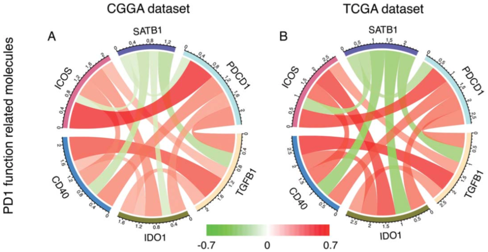

```{r setup, include=FALSE}
knitr::opts_chunk$set(echo = TRUE)
```

### 需求描述

用⭕️的方式展示correlation，画出像paper里这样的图



出自<https://doi.org/10.1080/2162402X.2017.1382792>

### 应用场景

展示每两个基因之间的相关关系，连线的颜色和宽度代表相关系数。

### 输入文件

- 必备：`easy_input.txt`，包含三列：基因名A、基因名B、基因A和B间的相关系数

**注意：**每两个基因之间都要有相关系数

- 可选：如果你想让基因按照特定的顺序排列在⭕️上，那就再提供一个`GeneList.txt`文件，把基因按照你想要的顺序排好，每行一个基因。

**注意：**这个文件里的基因名跟`easy_input.txt`的基因名必须一模一样。

```{r}
Links<- read.table("easy_input.txt", header = TRUE, sep = "\t",as.is = T)
head(Links)
```

### 计算基因长度

先整理成一个基因 + 一个相关系数的格式，排序

```{r}
Corr <- data.frame(rbind(cbind(Links[,1], Links[,3]), cbind(Links[,2], Links[,3])))
colnames(Corr) <- c("Gene","Correlation")
head(Corr)

#记录基因的原始排序，记录到Index列
Corr$Index <- seq(1,nrow(Corr),1)
#按照基因名排序
Corr <- Corr[order(Corr[,1]),]
str(Corr)#查看数据类型
#相关系数是factor，需要转换成numeric，后面才能用它计算
Corr[,2] <- as.numeric(as.character(Corr[,2]))
```

基因长度代表相关系数的总和，下面把总和保存在GeneID里

```{r}
#写入基因名
GeneID <- data.frame(GeneID=unique(Corr[,1]))

#一共有n+1个基因，跟n个基因有相关关系
n <- length(unique(Corr[,1]))-1

#写入基因起始位点，都是从0开始
GeneID$Gene_Start <-rep(0,n+1)
#依次计算每个基因的相关系数总和，作为基因终止位点
for (i in 1:(n+1)){
  GeneID$Gene_End[i] <- sum(abs(Corr[,2])[(i*n - (n - 1)):(i*n)])
}

#定义足够多的颜色
mycol <- c("#223D6C","#D20A13","#FFD121","#088247","#11AA4D","#58CDD9","#7A142C","#5D90BA","#431A3D","#91612D","#6E568C","#E0367A","#D8D155","#64495D","#7CC767")
#给每个基因一个颜色
GeneID$Color<-mycol[1:(n+1)]
head(GeneID)
```

基因是按字母排序出现在⭕️上的

如果你想规定基因的顺序，就提供"GeneList.txt"文件，然后运行下面这段代码。

```r
geneList <- read.table("GeneList.txt")
GeneID <- GeneID[geneList$V1,] #让GeneID按照"GeneList.txt"文件排序
GeneID$GeneID <- factor(GeneID$GeneID, levels = GeneID$GeneID)
head(GeneID)
```

### 计算连线的位置

把连线想象成弯曲的矩形，计算每个基因上每条线的起止位置。

```{r}
#连线的宽度是相关系数的绝对值
Corr[,2] <- abs(Corr[,2]) #取绝对值

for (i in 1 : (n + 1)){
  sub <- as.data.frame(Corr[(i*n - (n - 1)):(i*n),2])
  for (j in 2 : n){
    sub[1,2] <- 0
    sub[j,2] <- sub[j-1,2] + sub[j-1,1]
    sub[1,3] <- sub[1,1]
    sub[j,3] <- sub[j-1,3] + sub[j,1]
  }
  Corr[(i*n - (n - 1)):(i*n),4] <- sub[,2]
  Corr[(i*n - (n - 1)):(i*n),5] <- sub[,3]
}
#根据Index列，把基因恢复到原始排序
Corr <- Corr[order(Corr$Index),]
head(Corr)

#V4是起始位置，V5是终止位置
#把它写入Links里，start_1和end_1对应Gene_1，start_2和end_2对应Gene_2
Links$start_1 <- Corr$V4[1:(nrow(Corr)/2)]
Links$end_1 <- Corr$V5[1:(nrow(Corr)/2)]
Links$start_2 <- Corr$V4[(nrow(Corr)/2 + 1):nrow(Corr)]
Links$end_2 <- Corr$V5[(nrow(Corr)/2 + 1):nrow(Corr)]
head(Links)
```

### 计算连线的颜色

颜色代表相关系数

```{r}
#定义相关系数的颜色
#相关系数最大为1，最小-1，此处设置201个颜色
#-1到0就是前100，0到1就是后100
color <- data.frame(colorRampPalette(c("#67BE54", "#FFFFFF", "#F82C2B"))(201))
#根据相关系数的数值，给出相应的颜色
for (i in 1:nrow(Links)){
  Links[i,8] <- substring(color[Links[i,3] * 100 + 101, 1], 1, 7)
}
names(Links)[8] <- "color"
head(Links)
```

### 开始画图

```{r}
#安装circlize包
#install.packages("circlize")

#加载包
library(circlize)

#绘图区设置
pdf("correlation.pdf",width = 6,height = 6)

par(mar=rep(0,4))
circos.clear()
circos.par(start.degree = 90, #从哪里开始画，沿着逆时针顺序
           #gap.degree规定左右间隔，track.margin规定上下间隔
           gap.degree = 5, #基因bar之间的间隔大小
           track.margin = c(0,0.23), #值越大，基因跟连线的间隔越小
           cell.padding = c(0,0,0,0)
           )

circos.initialize(factors = GeneID$GeneID,
                  xlim = cbind(GeneID$Gene_Start, GeneID$Gene_End))

#先画基因
circos.trackPlotRegion(ylim = c(0, 1), factors = GeneID$GeneID, 
                       track.height = 0.05, #基因线条的胖瘦
                       #panel.fun for each sector
                       panel.fun = function(x, y) {
                         #select details of current sector
                         name = get.cell.meta.data("sector.index") #基因ID
                         i = get.cell.meta.data("sector.numeric.index") #基因数量
                         xlim = get.cell.meta.data("xlim")
                         ylim = get.cell.meta.data("ylim")
                         
                         #基因名
                         circos.text(x = mean(xlim), y = 1,
                                     labels = name,
                                     cex = 1.2, #基因ID文字大小
                                     niceFacing = TRUE, #保持基因名的头朝上
                                     facing = "bending",#基因名沿着圆弧方向，还可以是reverse.clockwise
                                     adj = c(0.5, -2.5), #基因名所在位置，分别控制左右和上下
                                     font = 2  #加粗
                                     )
                         
                         #plot main sector
                         circos.rect(xleft = xlim[1], 
                                     ybottom = ylim[1],
                                     xright = xlim[2], 
                                     ytop = ylim[2],
                                     col = GeneID$Color[i],
                                     border = GeneID$Color[i])
                      
                         #plot axis
                         circos.axis(labels.cex = 0.7, 
                                     direction = "outside"#,
                                     #默认就很好看，你还可以用下面的参数微调
                                     #主刻度设置
                                     #major.at = seq(from = 0,
                                     #               to = floor(GeneID$Gene_End)[i], 
                                     #               by = 400), #根据基因的长短自行调整
                                     #副刻度数量
                                     #minor.ticks = 4, 
                                     #labels.niceFacing = TRUE,
                                     #labels.facing = "outside" #或者clockwise
                         )})

#画连线
for(i in 1:nrow(Links)){
  circos.link(sector.index1 = Links$Gene_1[i], 
              point1 = c(Links[i, 4], Links[i, 5]),
              sector.index2 = Links$Gene_2[i], 
              point2 = c(Links[i, 6], Links[i, 7]),
              col = paste(Links$color[i], "C9", sep = ""), 
              border = FALSE, 
              rou = 0.7   #links起始和终止点的y值（圆半径的百分比）
              )}

#画图例
i <- seq(0,0.995,0.005)
rect(-1+i/2, #xleft
     -1, #ybottom
     -0.9975+i/2, #xright
     -0.96, #ytop
     col = paste(as.character(color[,1]), "FF", sep = ""),
     border = paste(as.character(color[,1]), "FF", sep = ""))
text(-0.97, -1.03, "-1")
text(-0.51, -1.03, "1")

dev.off()
```


```{r}
sessionInfo()
```