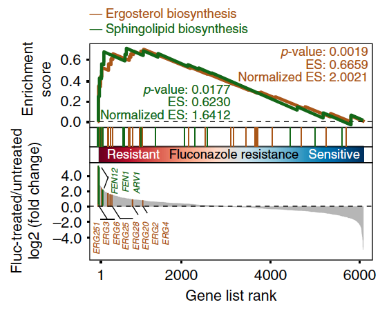

```{r setup, include=FALSE}
knitr::opts_chunk$set(echo = TRUE)
```

## 需求描述

clusterProfiler的GSEA结果作为输入，画出像paper里这样美的GSEA结果图。

关注“小丫画图”公众号（微信ID：FigureYa），回复“GSEA”，查看GSEA在paper里的高级用法。



出自<https://www.nature.com/articles/s41467-018-06944-1>

## 应用场景

适用于：用clusterProfiler做了富集分析，想自己DIY结果图的小伙伴。

如果想用Java版GSEA做富集分析，自己DIY结果图，请用FigureYa13GSEA_Java。

clusterProfiler擅长做富集分析，可以用GO、KEGG、Diseaes、Reactome、DAVID、MSigDB、甚至自定义的注释库做富集分析。enrichplot丰富的画图函数几乎涵盖了所有富集分析结果的展示方式，<http://bioconductor.org/packages/devel/bioc/vignettes/enrichplot/inst/doc/enrichplot.html>。

## 环境设置

```{r}
#使用国内镜像安装包
#options("repos"= c(CRAN="https://mirrors.tuna.tsinghua.edu.cn/CRAN/"))
#options(BioC_mirror="http://mirrors.ustc.edu.cn/bioc/")

library(clusterProfiler)
library(enrichplot)
#library(plyr)
library(ggrepel)
library(ggplot2)
library(RColorBrewer)
library(gridExtra)

Sys.setenv(LANGUAGE = "en") #显示英文报错信息
options(stringsAsFactors = FALSE) #禁止chr转成factor
```

## 输入文件的准备

下面这段代码仅仅为了获得clusterProfiler格式的GSEA结果。

> 有关用clusterProfiler做GSEA的问题，建议加入Y叔知识星球提问。

### 用clusterProfiler做GSEA

easy_input_rnk.txt：包含两列，基因名（SYMBOL）、变化倍数（logFC）

参考《[听说你有RNAseq数据却不知道怎么跑GSEA](http://mp.weixin.qq.com/s/aht5fQ10nH_07CYttKFH7Q)》

```{r}
gsym.fc <- read.table("easy_input_rnk.txt", header = T)
dim(gsym.fc)
head(gsym.fc)

#把gene symbol转换为ENTREZ ID
#此处物种是人，其他物种的ID转换方法，请参考FigureYa52GOplot
gsym.id <- bitr(gsym.fc$SYMBOL, fromType = "SYMBOL", toType = "ENTREZID", OrgDb = "org.Hs.eg.db")
head(gsym.id)
dim(gsym.id)

#让基因名、ENTREZID、foldchange对应起来
gsym.fc.id <- merge(gsym.fc, gsym.id, by="SYMBOL", all=F)
head(gsym.fc.id)

#按照foldchange排序
gsym.fc.id.sorted <- gsym.fc.id[order(gsym.fc.id$logFC, decreasing = T),]
head(gsym.fc.id.sorted)

#获得ENTREZID、foldchange列表，做为GSEA的输入
id.fc <- gsym.fc.id.sorted$logFC
names(id.fc) <- gsym.fc.id.sorted$ENTREZID
head(id.fc)

#这一条语句就做完了KEGG的GSEA分析
kk <- gseKEGG(id.fc, organism = "hsa")
dim(kk)
```

### 用clusterProfiler画GSEA结果图

用一条语句就画好了多条通路在一起的图：
```{r}
#你可以画指定行的通路
gseaplot2(kk, geneSetID = c(6,8), 
          color = c("darkgreen","chocolate4")) #自定义颜色

#也可以画指定ID的通路
gseaplot2(kk, geneSetID = c("hsa03030", "hsa03050"), 
          color = c("darkgreen","chocolate4")) #自定义颜色
```

你可能想要中间那条heatmap，仔细看下面的图，你会发现，那不是简单的heatmap，里面的颜色是有意义的。找找看，哪篇paper里的这条heatmap是“假的”？

```{r}
gseaplot2(kk, geneSetID = 2, 
          color = "darkgreen") #自定义颜色

gseaplot2(kk, geneSetID = 6, 
          color = "chocolate4") #自定义颜色
```

### 把富集的通路输出到文件

```{r}
#把ENTREZ ID转为gene symbol，便于查看通路里的基因
kk.gsym <- setReadable(kk, 'org.Hs.eg.db', #物种
                    'ENTREZID')

#按照enrichment score从高到低排序，便于查看富集的通路
sortkk <- kk.gsym[order(kk.gsym$enrichmentScore, decreasing = T),]
head(sortkk[1:5])
tail(sortkk[1:5])

#保存到文件
write.csv(sortkk,"gsea_output.csv", quote = F, row.names = F)
```

“gsea_output.csv”文件可作为文章的Supplementary File。

## 参数设置

此处我们选择“hsa03030”、“hsa03050”这两条通路，突出显示这两条通路里的几个基因。

```{r}
# 要画的通路
geneSetID <- c("hsa03030", "hsa03050")

# 突出显示感兴趣的基因
selectedGeneID <- c("MCM5", "MCM2", "MCM6","MA7","PSMD3","PSMB9")

# 自定义足够多的颜色
mycol <- c("darkgreen","chocolate4","blueviolet","#223D6C","#D20A13","#088247","#58CDD9","#7A142C","#5D90BA","#431A3D","#91612D","#6E568C","#E0367A","#D8D155","#64495D","#7CC767")

# 字号
base_size = 12

# rank mode
rankmode <- "comb" #合起来画
#rankmode <- "sep" #如果通路多，分开画更好
```

## DIY多条通路

提取包里的gseaplot2函数，压缩成小白能看懂的语句，加以注释，就可以按照自己的审美修改参数啦！

```{r, fig.width=5, fig.height=4}
x <- kk
geneList <- position <- NULL ## to satisfy codetool

#合并多条通路的数据
gsdata <- do.call(rbind, lapply(geneSetID, enrichplot:::gsInfo, object = x))
gsdata$gsym <- rep(gsym.fc.id.sorted$SYMBOL,2)

# 画running score
p.res <- ggplot(gsdata, aes_(x = ~x)) + xlab(NULL) +
  geom_line(aes_(y = ~runningScore, color= ~Description), size=1) +
  scale_color_manual(values = mycol) +
  
  scale_x_continuous(expand=c(0,0)) + #两侧不留空
  geom_hline(yintercept = 0, lty = 2, lwd = 0.2) + #在0的位置画虚线
  ylab("Enrichment\n Score") +
  
  theme_bw(base_size) +
  theme(panel.grid = element_blank()) + #不画网格
  
  theme(legend.position = "top", legend.title = element_blank(),
        legend.background = element_rect(fill = "transparent")) +
  
  theme(axis.text.x=element_blank(),
        axis.ticks.x=element_blank(),
        axis.line.x=element_blank(),
        plot.margin=margin(t=.2, r = .2, b=0, l=.2, unit="cm"))
p.res


# 画rank
if (rankmode == "comb") {
  rel_heights <- c(1.5, .2, 1.5) # 上中下三个部分的比例
  
  p2 <- ggplot(gsdata, aes_(x = ~x)) +
    geom_bar(position = "dodge",stat = "identity",
             aes(x, y = position*(-0.1), fill=Description))+
    xlab(NULL) + ylab(NULL) + 
    scale_fill_manual(values = mycol) + #用自定义的颜色
  
    theme_bw(base_size) +
    theme(panel.grid = element_blank()) + #不画网格
  
    theme(legend.position = "none",
          plot.margin = margin(t=-.1, b=0,unit="cm"),
          axis.ticks = element_blank(),
          axis.text = element_blank(),
          axis.line.x = element_blank()) +
    scale_x_continuous(expand=c(0,0)) +
    scale_y_continuous(expand=c(0,0))

} else if (rankmode == "sep") {
  rel_heights <- c(1.5, .5, 1.5) # 上中下三个部分的比例

  i <- 0
  for (term in unique(gsdata$Description)) {
    idx <- which(gsdata$ymin != 0 & gsdata$Description == term)
    gsdata[idx, "ymin"] <- i
    gsdata[idx, "ymax"] <- i + 1
    i <- i + 1
  }
  
  head(gsdata)
  
  p2 <- ggplot(gsdata, aes_(x = ~x)) +
    geom_linerange(aes_(ymin=~ymin, ymax=~ymax, color=~Description)) +
    xlab(NULL) + ylab(NULL) + 
    scale_color_manual(values = mycol) + #用自定义的颜色
  
    theme_bw(base_size) +
    theme(panel.grid = element_blank()) + #不画网格
  
    theme(legend.position = "none",
          plot.margin = margin(t=-.1, b=0,unit="cm"),
          axis.ticks = element_blank(),
          axis.text = element_blank(),
          axis.line.x = element_blank()) +
    scale_x_continuous(expand=c(0,0)) +
    scale_y_continuous(expand=c(0,0))
} else {stop("Unsupport mode")}

p2

# 画变化倍数
df2 <- p.res$data
df2$y <- p.res$data$geneList[df2$x]
df2$gsym <- p.res$data$gsym[df2$x]
head(df2)

# 提取感兴趣的基因的变化倍数
selectgenes <- data.frame(gsym = selectedGeneID)
selectgenes <- merge(selectgenes, df2, by = "gsym")
selectgenes <- selectgenes[selectgenes$position == 1,]
head(selectgenes)

p.pos <- ggplot(selectgenes, aes(x, y, fill = Description, color = Description, label = gsym)) + 
  geom_segment(data=df2, aes_(x=~x, xend=~x, y=~y, yend=0), 
               color = "grey") +
  geom_bar(position = "dodge", stat = "identity") +
  scale_fill_manual(values = mycol, guide=FALSE) + #用自定义的颜色
  scale_color_manual(values = mycol, guide=FALSE) + #用自定义的颜色

  scale_x_continuous(expand=c(0,0)) +
  geom_hline(yintercept = 0, lty = 2, lwd = 0.2) + #在0的位置画虚线
  ylab("Ranked list\n metric") +
  xlab("Rank in ordered dataset") +
  
  theme_bw(base_size) +
  theme(panel.grid = element_blank()) +

  # 显示感兴趣的基因的基因名
  geom_text_repel(data = selectgenes, 
                  show.legend = FALSE, #不显示图例
                  direction = "x", #基因名横向排列在x轴方向
                  ylim = c(2, NA), #基因名画在-2下方
                  angle = 90, #基因名竖着写
                  size = 2.5, box.padding = unit(0.35, "lines"), 
        point.padding = unit(0.3, "lines")) +
  theme(plot.margin=margin(t = -.1, r = .2, b=.2, l=.2, unit="cm"))

p.pos


# 组图
plotlist <- list(p.res, p2, p.pos)
n <- length(plotlist)
plotlist[[n]] <- plotlist[[n]] +
  theme(axis.line.x = element_line(),
        axis.ticks.x = element_line(),
        axis.text.x = element_text())

plot_grid(plotlist = plotlist, ncol = 1, align="v", rel_heights = rel_heights)

# 保存到PDF文件
if (rankmode == "comb"){ggsave("GSEA_comb.pdf", width=6,height=5)} else if (rankmode == "sep") {ggsave("GSEA_sep.pdf",width=6,height=5)} else {stop("Unsupport mode")}
```

```{r}
sessionInfo()
```