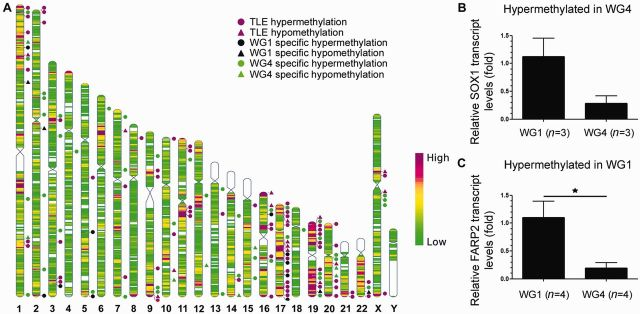

### 需求描述
用R代码画出paper里的直的染色体分布图



来源<https://www.ncbi.nlm.nih.gov/pmc/articles/PMC4408428/>

### 使用场景
差异表达基因（RNA-seq）、开放染色质（DNase/ATAC-seq）、CTCF结合位点（ChIP-seq）、突变位点（WGS）或DNA甲基化（WGBS）在染色体上的分布，或者只是画Ideogram


### 输入数据

karyotype.txt，包含染色体名称、起始和终止点、着丝粒起始和终止点的文件，用于画染色体轮廓

分五列，0-based基因组坐标(以0-based开始、1-based结束)，第一列染色体名，第二、三列染色体起始及终止点，第四、五列为着丝粒起始及终止点

```{r}
# 染色体长度、中心粒位置
karyotype <- read.table("karyotype.txt", sep = "\t", header = T, stringsAsFactors = F, colClasses = c("character", "integer", "integer", "integer", "integer"))
head(karyotype)
```

data_1.txt，感兴趣的区域的值，例如差异基因的log2foldchange、甲基化水平等，用来绘制染色体heatmap files

分四列，第一列染色体，第二、三列染色体上的位置，第四列对应的数值
```{r}
mydata <- read.table("data_1.txt", sep = "\t", header = T, stringsAsFactors = F, colClasses = c("character", "integer", "integer", "integer"))
head(mydata)
```

data_2.txt，如果想画染色体旁边的形状标记，就要提供这个文件，例如关键基因或区域的位置标注。

分六列，第一列名称，第二列形状（只支持box正方形、triangle三角形和circle圆），第四列染色体，第五、六列染色体上的位置，第七类颜色，注意同一类的type对应的颜色一致)

```{r}
mydata_interval <- read.table("data_2.txt", sep = "\t", header = T, stringsAsFactors = F, colClasses = c("character", "character", "character", "integer", "integer", "character"))
head(mydata_interval)
```

### 写画图语句

画布大小将设置为A4纸，宽高为210mm * 297mm

页边距设置：左、右、顶、底为20mm, 20mm, 25mm, 25mm，因此最终的画图区域宽高为170mm * 247mm

#### 1.先写染色体轮廓

图形将由n个染色体+n个注释用空隙组成

图形宽度设置成170mm, 染色体与空隙等宽，则每个染色体或空隙宽度应设置为(170/2n)mm

长度像素换算公式：1mm = 3.543307px

计算各染色体轮廓各节点坐标

```{r}
mpx<-3.543307 #换算比
chr_width <- 170 / (2*nrow(karyotype)) * mpx  #170mm可以根据染色体条数适当调整

karyotype$x9 <- karyotype$x1 <- karyotype$x8 <- karyotype$x4 <- karyotype$x5 <- karyotype$x12 <- apply(data.frame(1:nrow(karyotype)),1,function(x)(20*mpx+(x[1]-1)*2*chr_width))
maxchrlen<-150 #最长染色体长度设置为150mm
karyotype$y1 <- karyotype$y2 <- apply(data.frame(karyotype$End),1,function(x)((25+maxchrlen*(1-x[1]/max(karyotype$End))) * mpx + chr_width/2)) #染色体顶部圆弧高度为chr_width/2
karyotype$x10 <- karyotype$x2 <- karyotype$x3 <- karyotype$x7 <- karyotype$x6 <- karyotype$x11 <- karyotype$x1+chr_width
karyotype$y3 <- karyotype$y8 <- apply(data.frame(karyotype$End,karyotype$CE_start),1,function(x)((25+maxchrlen*(1-(x[1]-x[2])/max(karyotype$End))) * mpx))
karyotype$y4 <- karyotype$y7 <- apply(data.frame(karyotype$End,karyotype$CE_end),1,function(x)((25+maxchrlen*(1-(x[1]-x[2])/max(karyotype$End))) * mpx))
karyotype$y5 <- karyotype$y6 <- (25+maxchrlen)*mpx-chr_width/2
karyotype$y9 <- karyotype$y10 <- apply(data.frame(karyotype$End),1,function(x)((25+maxchrlen*(1-x[1]/max(karyotype$End))) * mpx))
karyotype$y11 <- karyotype$y12 <- (25+maxchrlen)*mpx
```

画染色体轮廓

```{r}
karyotype$path = paste("<path d=\"M", karyotype$x1, ",", karyotype$y1, 
                       " A", chr_width/2, ",", chr_width/2, " 0 1,1 ", karyotype$x2, ",", karyotype$y2, #圆弧
                       " L", karyotype$x3, ",", karyotype$y3,
                       " L", karyotype$x4, ",", karyotype$y4, 
                       " L", karyotype$x5, ",", karyotype$y5, 
                       " A", chr_width/2, ",", chr_width/2, " 0 0,0 ", karyotype$x6, ",", karyotype$y6, 
                       " L", karyotype$x7, ",", karyotype$y7, 
                       " L", karyotype$x8, ",", karyotype$y8, 
                       " Z" ,"\" style=\"fill:none; stroke:grey; stroke-width:1\"/>", sep = "")

karyotype$hat = paste("<path d=\"M", karyotype$x1, ",", karyotype$y1, 
                      " A", chr_width/2, ",", chr_width/2, " 0 1,1 ", karyotype$x2, ",", karyotype$y2, #圆弧
                      " L", karyotype$x10, ",", karyotype$y10,
                      " L", karyotype$x9, ",", karyotype$y9, 
                      " Z" ,"\" style=\"fill:white; stroke:white; stroke-width:0.75\"/>", sep = "")

karyotype$shoe = paste("<path d=\"M", karyotype$x5, ",", karyotype$y5, 
                      " A", chr_width/2, ",", chr_width/2, " 0 0,0 ", karyotype$x6, ",", karyotype$y6,
                      " L", karyotype$x11, ",", karyotype$y11,
                      " L", karyotype$x12, ",", karyotype$y12, 
                      " Z" ,"\" style=\"fill:white; stroke:white; stroke-width:0.75\"/>", sep = "")

karyotype$bow = paste("<path d=\"M", karyotype$x8, ",", karyotype$y8, 
                      " L", karyotype$x7, ",", karyotype$y7,
                      " L", karyotype$x3, ",", karyotype$y3, 
                      " L", karyotype$x4, ",", karyotype$y4,                       
                      " Z" ,"\" style=\"fill:white; stroke:white; stroke-width:0.75\"/>", sep = "")
```

染色体底部加染色体名

```{r}
karyotype$text = paste("<text x=\"", (karyotype$x1 + karyotype$x2)/2 - nchar(karyotype$Chr) * 2.2, "\" y=\"", (150 + 25) * mpx + 15, "\" font-size=\"9\" fill=\"black\" >", karyotype$Chr, "</text>", sep = "")
```

#### 2.染色体上填色语句

```{r}
# data_1
# 自定义渐变色注意同时修改下面的data1_legend保持一致
require(graphics)
require(scales)
cnum<-1000 #颜色板色彩的数量设置
mydata$color <- colorRampPalette(c("navy", "white", "firebrick3"))(cnum)[round(rescale(mydata$Value,to=c(1,cnum)))] #根据value配置颜色，使用白色则要求mydata中基因组均有value

mydata<-merge(mydata,data.frame(Chr=karyotype$Chr,ChrEnd=karyotype$End,x1=karyotype$x1,x2=karyotype$x2),by="Chr")

mydata$y1 <- apply(data.frame(mydata$ChrEnd,mydata$Start),1,function(x)((25+maxchrlen*(1-(x[1]-x[2])/max(karyotype$End))) * mpx))
mydata$y2 <- apply(data.frame(mydata$ChrEnd,mydata$End),1,function(x)((25+maxchrlen*(1-(x[1]-x[2])/max(karyotype$End))) * mpx))

mydata$rect = paste("<path d=\"M", mydata$x1, ",", mydata$y1, 
                    " L", mydata$x2, ",", mydata$y1, 
                    " L", mydata$x2, ",", mydata$y2, 
                    " L", mydata$x1, ",", mydata$y2, 
                    " Z" ,"\" style=\"fill:", mydata$color, "; stroke:", mydata$color, "; stroke-width:0.25\"/>", sep = "")

# legend for mydata
mydata_legend <- data.frame(color=colorRampPalette(c("navy", "white", "firebrick3"))(cnum)) #颜色与上面data1的设置保持一致
mydata_legend$x1<-apply(data.frame(1:cnum),1,function(x)((20 + 140) * mpx + (x[1] - 1) * ((20 * mpx) / cnum)))
mydata_legend$y1<-(25 + 10) * mpx
mydata_legend$legend<-paste("<rect x=\"", mydata_legend$x1, "\" y=\"", mydata_legend$y1, 
                            "\" width=\"", (20 * mpx) / cnum,  
                            "\" height=\"", 4 * mpx, 
                            "\" style=\"fill:", mydata_legend$color, ";stroke:none\"/>", sep = "")

legend_text <- data.frame(paste("<text x=\"", min(mydata_legend$x1), 
                                "\" y=\"", min(mydata_legend$y1) + 8 * mpx - 3, 
                                "\" font-size=\"12\" fill=\"black\" >Low</text>", sep = ""),
                          paste("<text x=\"", max(mydata_legend$x1) - 25,
                                "\" y=\"", min(mydata_legend$y1) + 8 * mpx - 3,
                                "\" font-size=\"12\" fill=\"black\" >High</text>", sep = "")
)
```

#### 3.染色体旁边的形状标记

如果没提供data_2.txt，就略过这部分，直接进入“将准备好的svg语句写入.svg文件”

```{r}
# data_2
mydata_interval<-merge(mydata_interval,data.frame(Chr=karyotype$Chr,ChrEnd=karyotype$End,x2=karyotype$x2),by="Chr")

mydata_interval$x <- mydata_interval$x2 + chr_width / 3
mydata_interval$y0 <- apply(data.frame(mydata_interval$ChrEnd,mydata_interval$Start,mydata_interval$End),1,function(x)((25+maxchrlen*(1-(x[1]-(x[2]+x[3])/2)/max(karyotype$End))) * mpx))
mydata_interval<-mydata_interval[order(mydata_interval$Chr,mydata_interval$y0),]

#repel函数，用于移动染色体旁边的标记，避免太多时互相重叠
repel<-function(mydata,myforce,tag){
  #print(tag)
  #myordata<-sort(mydata)
  #if(length(mydata)==1){return(mydata)}
  if(min(diff(mydata)) >= myforce | tag==3000){return(mydata)}
  tag<-tag+1
  sp<-which.min(diff(mydata))
  ep<-sp+1
  mydata[sp]<-mydata[sp]-myforce
  mydata[ep]<-mydata[ep]+myforce
  mydepo<-sort(mydata)
  return(repel(mydepo,myforce,tag))
}

mydata_interval$y <- NA
for (chr in unique(mydata_interval$Chr)){
  if(nrow(mydata_interval[mydata_interval$Chr==chr,])>1){
    mydata_interval[mydata_interval$Chr == chr,]$y <-repel(mydata_interval[mydata_interval$Chr == chr,]$y0, chr_width/3, 1)
  }else{mydata_interval[mydata_interval$Chr == chr,]$y <- mydata_interval[mydata_interval$Chr == chr,]$y0}
}

mydata_interval_triangle<- mydata_interval[mydata_interval$Shape == "triangle",]
mydata_interval_triangle$interval <- paste("<path d=\"M", mydata_interval_triangle$x - chr_width / 6, ",", mydata_interval_triangle$y + chr_width / 6,
                                           " L", mydata_interval_triangle$x + chr_width / 6, ",", mydata_interval_triangle$y + chr_width / 6,
                                           " L", mydata_interval_triangle$x, ",", mydata_interval_triangle$y - chr_width / 6,
                                           " Z" ,"\" style=\"fill:#", mydata_interval_triangle$color, ";stroke:none\"/>", sep = "")
  
mydata_interval_box<- mydata_interval[mydata_interval$Shape == "box",]
mydata_interval_box$interval <- paste("<rect x=\"", mydata_interval_box$x - chr_width / 6, 
                                      "\" y=\"", mydata_interval_box$y - chr_width / 6,
                                      "\" width=\"", chr_width / 3,
                                      "\" height=\"", chr_width / 3,
                                      "\" style=\"fill:#", mydata_interval_box$color, "; stroke:none\"/>", sep = "")

mydata_interval_circle<- mydata_interval[mydata_interval$Shape == "circle",]
mydata_interval_circle$interval <- paste("<circle cx=\"", mydata_interval_circle$x,
                                         "\" cy=\"", mydata_interval_circle$y,
                                         "\" r=\"", chr_width / 6,
                                         "\" style=\"fill:#", mydata_interval_circle$color, "; stroke:none\"/>", sep = "")

mydata_interval<-rbind(mydata_interval_box,mydata_interval_circle,mydata_interval_triangle)
mydata_interval$line <- paste("<line x1=\"", mydata_interval$x2, 
                               "\" y1=\"", mydata_interval$y0,
                               "\" x2=\"", mydata_interval$x,
                               "\" y2=\"", mydata_interval$y,
                               "\" style=\"stroke:#", mydata_interval$color, "; stroke-width:0.25\"/>", sep = "")


# legend for mydata2
mydata2_legend <- mydata_interval[!duplicated(mydata_interval$Type), 1:6]
mydata2_legend <- mydata2_legend[order(mydata2_legend$Shape, mydata2_legend$color),]

mydata2_legend$x<-mydata_legend$x1[1]
mydata2_legend$y<-apply(data.frame(1:nrow(mydata2_legend)),1,function(x)(mydata_legend$y1[1]+ 4 + (12 + (x[1] - 1) * 4 ) * mpx))
mydata2_legend$x1<-mydata2_legend$x + 4
mydata2_legend$y1<-mydata2_legend$y- 4 * mpx / 2

for (i in 1:nrow(mydata2_legend)){
  if (mydata2_legend[i, 3] == "triangle") {
    mydata2_legend[i,11] = paste("<path d=\"M", mydata2_legend[i,9] - 4, ",", mydata2_legend[i,10] + 4, " L", mydata2_legend[i,9] + 4, ",", mydata2_legend[i,10] + 4, " L", mydata2_legend[i,9], ",", mydata2_legend[i,10] - 4, " Z" ,"\" style=\"fill:#", mydata2_legend[i, 6], "; stroke:none\"/>", sep = "")
  }
  else if (mydata2_legend[i, 3] == "box") {
    mydata2_legend[i,11] <- paste("<rect x=\"", mydata2_legend[i,9] - 4, "\" y=\"", mydata2_legend[i,10] - 4, "\" width=\"", 8,  "\" height=\"", 8, "\" style=\"fill:#", mydata2_legend[i, 6], ";stroke:none\"/>", sep = "")
  }
  else if (mydata2_legend[i, 3] == "circle") {
    mydata2_legend[i,11] <- paste("<circle cx=\"", mydata2_legend[i,9], "\" cy=\"", mydata2_legend[i,10], "\" r=\"", 4, "\" style=\"fill:#", mydata2_legend[i, 6], ";stroke:none\"/>", sep = "")
  }
}
names(mydata2_legend)[11] <- "shape"

for (i in 1:nrow(mydata2_legend)){
  mydata2_legend[i,12] <- paste("<text x=\"", mydata2_legend[i,7] + 15, "\" y=\"", mydata2_legend[i,8] - (4 * mpx / 2 - 4), "\" font-size=\"12\" fill=\"black\" >", mydata2_legend[i,2],"</text>", sep = "")
}
names(mydata2_legend)[12] <- "name"
```

### 将准备好的svg语句写入.svg文件

必备的语句
```{r}
#写入文件头
first_line <- data.frame("<?xml version=\"1.0\" standalone=\"no\"?>",
                         "<!DOCTYPE svg PUBLIC \"-//W3C//DTD SVG 1.1//EN\"",
                         "\"http://www.w3.org/Graphics/SVG/1.1/DTD/svg11.dtd\">",
                         "",
                         paste("<svg id=\"svg\" width=\"744.0945\" height=\"1052.362\">", "\t")
)

write.table(first_line[1, 1], "chromsome.svg", col.names = FALSE, row.names = FALSE, quote = FALSE)
write.table(first_line[1, 2], "chromsome.svg", col.names = FALSE, row.names = FALSE, quote = FALSE, append = TRUE)
write.table(first_line[1, 3], "chromsome.svg", col.names = FALSE, row.names = FALSE, quote = FALSE, append = TRUE)
write.table(first_line[1, 4], "chromsome.svg", col.names = FALSE, row.names = FALSE, quote = FALSE, append = TRUE)
write.table(first_line[1, 5], "chromsome.svg", col.names = FALSE, row.names = FALSE, quote = FALSE, append = TRUE)

#填充色彩
write.table(mydata$rect, "chromsome.svg", col.names = FALSE, row.names = FALSE, quote = FALSE, append = TRUE)

#染色体轮廓
write.table(karyotype$hat, "chromsome.svg", col.names = FALSE, row.names = FALSE, quote = FALSE, append = TRUE)
write.table(karyotype$shoe, "chromsome.svg", col.names = FALSE, row.names = FALSE, quote = FALSE, append = TRUE)
write.table(karyotype$bow, "chromsome.svg", col.names = FALSE, row.names = FALSE, quote = FALSE, append = TRUE)
write.table(karyotype$path, "chromsome.svg", col.names = FALSE, row.names = FALSE, quote = FALSE, append = TRUE)
write.table(karyotype$text, "chromsome.svg", col.names = FALSE, row.names = FALSE, quote = FALSE, append = TRUE)

#色彩legend
write.table(mydata_legend$legend, "chromsome.svg", col.names = FALSE, row.names = FALSE, quote = FALSE, append = TRUE)
write.table(legend_text[1,1], "chromsome.svg", col.names = FALSE, row.names = FALSE, quote = FALSE, append = TRUE)
write.table(legend_text[1,2], "chromsome.svg", col.names = FALSE, row.names = FALSE, quote = FALSE, append = TRUE)
```

连线，不想要染色体和标记之间连线的，就不运行这行
```{r}
write.table(mydata_interval$line, "chromsome.svg", col.names = FALSE, row.names = FALSE, quote = FALSE, append = TRUE)
```

形状和形状的legend，不想要染色体旁边标记的，不运行这部分
```{r}
write.table(mydata_interval$interval, "chromsome.svg", col.names = FALSE, row.names = FALSE, quote = FALSE, append = TRUE)
write.table(mydata2_legend$shape, "chromsome.svg", col.names = FALSE, row.names = FALSE, quote = FALSE, append = TRUE)
write.table(mydata2_legend$name, "chromsome.svg", col.names = FALSE, row.names = FALSE, quote = FALSE, append = TRUE)
```

必备的语句
```{r}
#文件尾
last_line <- data.frame(paste("</svg>"))
write.table(last_line[1, 1], "chromsome.svg", col.names = FALSE, row.names = FALSE, quote = FALSE, append = TRUE)
```

### 输出文件
输出*.svg文件，矢量图，可以用illustrator、Inkscape等工具打开


```{r}
sessionInfo()
```